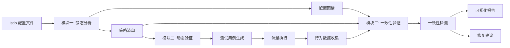

# MeshScope - Istio 配置验证与可视化系统

> 一个完整的 Istio 服务网格配置分析、动态验证与一致性检测平台

## 📐 系统架构

```
┌─────────────────────────────────────────────────────────────────┐
│                        MeshScope 系统                             │
├─────────────────────────────────────────────────────────────────┤
│                                                                   │
│  ┌─────────────────────┐         ┌─────────────────────┐       │
│  │  模块一：静态分析    │────────>│  模块三：一致性     │       │
│  │  Static Analysis    │         │  验证与可视化        │       │
│  │  (配置图谱构建)      │         │  Consistency Check  │       │
│  └─────────────────────┘         └─────────────────────┘       │
│           │                               ▲                      │
│           │                               │                      │
│           │     ┌─────────────────────┐   │                      │
│           └────>│  模块二：动态验证    │───┘                      │
│                 │  Dynamic Testing    │                          │
│                 │  (行为观测)          │                          │
│                 └─────────────────────┘                          │
│                                                                   │
└─────────────────────────────────────────────────────────────────┘
```

---

## 🎯 模块一：静态配置分析模块

**目录**: `istio_config_parser/`

### 核心功能
解析 Istio 控制面配置，构建服务拓扑图谱，检测配置冲突与作用范围不一致。

### 主要组件

```
istio_config_parser/
├── istio_control_config/    # Istio 配置文件（按资源类型分类）
│   ├── services/            # Service 配置
│   ├── virtualservices/     # VirtualService 路由规则
│   ├── destinationrules/    # DestinationRule 流量策略
│   ├── gateways/            # Gateway 网关配置
│   └── envoyfilters/        # EnvoyFilter 自定义配置
│
├── models/                  # 数据结构定义
│   ├── control_plane_data.py      # 控制面数据模型
│   └── data_structures.py         # 通用数据结构
│
├── traffic_management/      # 策略解析器
│   ├── route_parser.py            # 路由解析
│   ├── canary_parser.py           # 金丝雀发布
│   ├── circuit_breaker_parser.py  # 熔断策略
│   └── ratelimit_parser.py        # 限流策略
│
├── static/                  # 前端可视化
│   └── js/components/
│       ├── TopologyGraph.jsx      # 服务拓扑图
│       ├── ConfigGraph.jsx        # 配置关系图
│       └── DataPlaneGraph.jsx     # 数据面图谱
│
└── main_parser.py          # 主解析入口
```

### 核心能力

| 功能 | 说明 | 输出 |
|------|------|------|
| **配置解析** | 解析 VirtualService、DestinationRule 等 | 结构化配置数据 |
| **拓扑构建** | 构建服务依赖关系图谱 | 服务拓扑 JSON |
| **策略提取** | 提取路由、熔断、限流等策略 | 策略清单 |
| **冲突检测** | 检测全局/局部策略冲突 | 冲突报告 |
| **可视化** | 以图谱形式展示配置关系 | 交互式前端 |

### 使用示例

```bash
# 解析控制面配置
cd istio_config_parser
python main_parser.py --namespace online-boutique

# 输出：
#   - 服务列表及端口配置
#   - 路由规则与权重分布
#   - 熔断/限流策略
#   - 服务依赖关系图谱
```

---

## 🚀 模块二：动态测试与验证模块

**目录**: `istio_Dynamic_Test/`

### 核心功能
基于正交设计生成测试用例，执行动态流量测试，收集运行时行为数据并验证配置一致性。

### 主要组件

```
istio_Dynamic_Test/
├── generator/               # 正交用例生成子模块
│   ├── test_case_generator.py     # 测试用例生成器（正交设计）
│   ├── istio_config.json          # Istio 配置输入
│   └── output_matrix.json         # 测试矩阵输出
│
├── checker/                 # 动态行为执行子模块
│   ├── traffic_driver.py          # 流量驱动器（SSH远程执行）
│   ├── fault_injector.py          # 故障注入器
│   └── orthogonal_handler.py      # 正交策略处理器
│
├── recorder/                # 数据收集子模块
│   ├── envoy_log_collector.py     # Envoy 访问日志收集
│   ├── prometheus_collector.py    # 性能指标收集
│   └── jaeger_trace_collector.py  # 链路追踪收集
│
├── verifier/                # 结果验证子模块
│   ├── main_verifier.py           # 主验证程序
│   ├── behavior_model.py          # 行为模型定义
│   ├── result_comparator.py       # 结果对比器
│   ├── log_parser.py              # 日志解析器
│   └── report_generator.py        # 报告生成器
│
├── utils/                   # 工具模块
│   ├── ssh_utils.py               # SSH 远程执行
│   └── envoy_log_utils.py         # Envoy 日志工具
│
└── results/                 # 测试结果存储
    ├── http_results/              # HTTP 测试结果
    ├── envoy_logs/                # Envoy 访问日志
    └── verification/              # 验证报告
```

### 四种正交原则

#### 1. **匹配条件维度正交**
一个请求同时验证多个服务的匹配规则
```
请求: Header[user-agent=jason] + Path[/test]
验证: reviews → v2 (user-agent匹配)
      ratings → v3 (path匹配)
```

#### 2. **功能策略间正交**
同一请求路径中的策略不相互屏蔽
```
组合: 故障注入(入口触发) + 重试(失败触发) + 超时(响应触发)
效果: 一个用例验证三个策略
```

#### 3. **全局/局部策略正交**
VirtualService(局部) + DestinationRule(全局) 协同验证
```
局部策略: VirtualService 路由匹配、重试、超时
全局策略: DestinationRule 熔断、连接池
验证: 在同一请求中观测两者协同效果
```

#### 4. **策略触发机制正交**
不同生命周期阶段的策略可组合
```
请求入口: routing, fault_injection
失败时:   retry, circuit_breaker
负载时:   connection_pool, rate_limit
响应时:   timeout
```

### 完整测试流程

```bash
# 步骤1：生成正交测试用例
cd generator
python test_case_generator.py \
  -i istio_config.json \
  --service-deps ../service_dependencies.json \
  --ingress-url http://192.168.92.131:30476/productpage \
  -o ../output_matrix.json

# 步骤2：执行测试流量（自动注入故障、收集日志）
cd ../checker
python traffic_driver.py \
  -i ../output_matrix.json \
  --ssh-host 192.168.92.131 \
  --ssh-user root \
  --ssh-password 12345678

# 步骤3：验证结果并生成报告
cd ../verifier
python main_verifier.py \
  --matrix ../output_matrix.json \
  --logs ../results/envoy_logs \
  --output ../results/verification

# 输出：
#   - HTML 可视化报告
#   - JSON 机器可读数据
#   - TXT 文本摘要
```

### 核心能力

| 功能 | 说明 | 技术亮点 |
|------|------|----------|
| **正交用例生成** | 4种正交原则减少50%+测试用例 | 统计学样本计算 |
| **自动故障注入** | 支持5种故障类型 | VirtualService自动patch |
| **多源数据收集** | HTTP结果 + Envoy日志 + Prometheus | 多维度验证 |
| **智能对比** | 期望行为 vs 实际行为 | 统计学方法（卡方检验）|
| **可视化报告** | HTML/JSON/TXT 三种格式 | CI/CD集成友好 |

---

## 🔍 模块三：一致性验证与可视化模块

**目录**: `consistency_verification/` （融合前两大模块）

### 核心功能
融合静态图谱与动态行为，进行最终一致性判定，以可视化方式展示不一致区域与影响路径。

### 主要组件

```
consistency_verification/
├── detector/                # 一致性检测子模块
│   ├── static_analyzer.py          # 静态配置分析器
│   ├── dynamic_analyzer.py         # 动态行为分析器
│   ├── consistency_checker.py      # 一致性检测核心
│   └── deviation_detector.py       # 行为偏差检测器
│
├── visualization/           # 图谱与报告可视化子模块
│   ├── graph_visualizer.py         # 图谱可视化生成器
│   ├── inconsistency_marker.py     # 不一致区域高亮
│   ├── report_generator.py         # 综合报告生成器
│   └── frontend/
│       ├── ConsistencyGraph.jsx    # 一致性图谱组件
│       ├── DeviationHeatMap.jsx    # 偏差热力图
│       └── ImpactPathViewer.jsx    # 影响路径可视化
│
└── integration/             # 模块集成
    └── pipeline.py                 # 端到端验证流水线
```

### 一致性检测维度

| 维度 | 检测内容 | 示例 |
|------|---------|------|
| **作用范围一致性** | Global vs Local 策略冲突 | DR全局熔断 vs VS局部熔断配置 |
| **行为偏差** | 配置期望 vs 实际行为 | 期望路由v2，实际路由v1 |
| **配置生效性** | 配置存在但不生效 | 重试配置3次但日志显示未重试 |
| **意外行为** | 未配置但出现的行为 | 未配置熔断但503触发熔断 |

### 端到端验证流程

```bash
# 一键执行完整验证流程
python consistency_verification/integration/pipeline.py \
  --config-dir istio_control_config \
  --test-config istio_Dynamic_Test/output_matrix.json \
  --output reports/

# 执行步骤：
# 1. 静态配置分析 → 提取策略清单
# 2. 动态测试执行 → 收集行为数据
# 3. 一致性检测   → 对比分析
# 4. 可视化报告   → 生成图谱与报告

# 输出：
# ├── consistency_report.html      # 可视化报告
# ├── consistency_graph.json       # 图谱数据
# ├── deviation_analysis.json      # 偏差分析
# └── remediation_guide.md         # 修复指南
```

### 可视化能力

#### 1. **一致性图谱**
```
节点颜色：
  🟢 绿色 - 一致性 ≥ 90%
  🟡 黄色 - 一致性 70-90%
  🔴 红色 - 一致性 < 70%

节点类型：
  ⚪ 服务节点 - 显示整体一致性率
  🔷 策略节点 - 显示具体策略状态
  
边类型：
  ──── 实线 - 服务依赖关系
  ---- 虚线 - 配置影响关系
```

#### 2. **不一致标记**
```
⚠️  动画脉冲 - 高严重性不一致
⚡ 静态图标 - 中严重性不一致
ℹ️  提示图标 - 低严重性不一致
```

#### 3. **影响路径追踪**
```
服务A → [路由策略不一致] → 服务B
       → 影响：10%流量路由错误
       → 根因：VirtualService match条件错误
       → 修复：调整 spec.http[].match[].headers
```

---

## 🔄 三大模块协作流程



### 数据流转

```
配置文件 (YAML)
    ↓
【静态分析】
    ↓
策略清单 + 服务图谱 (JSON)
    ↓
【测试生成】→ 测试矩阵 (JSON)
    ↓
【流量执行】→ HTTP结果 + Envoy日志
    ↓
【行为提取】→ 动态行为数据 (JSON)
    ↓
【一致性对比】
    ↓
验证报告 (HTML/JSON/MD) + 可视化图谱
```

---

## 🎯 核心价值

### 1. **全面覆盖**
- ✅ 静态配置检测（语法、冲突、作用域）
- ✅ 动态行为验证（路由、分流、熔断、重试）
- ✅ 一致性保障（配置与行为对比）

### 2. **高效验证**
- 🚀 正交设计减少50%+测试用例
- 🚀 自动化端到端流程
- 🚀 并行执行提升速度

### 3. **精准定位**
- 🎯 根因自动分析
- 🎯 影响路径追踪
- 🎯 修复建议生成

### 4. **可视化展示**
- 📊 服务拓扑图谱
- 📊 一致性热力图
- 📊 交互式报告

### 5. **DevOps友好**
- 🔧 JSON格式支持CI/CD集成
- 🔧 命令行工具易于自动化
- 🔧 增量验证支持持续集成

---

## 📊 使用场景

| 场景 | 使用模块 | 效果 |
|------|---------|------|
| **配置审查** | 模块一 | 发现配置冲突、作用范围问题 |
| **新版本上线** | 模块二 | 验证金丝雀发布、流量分割 |
| **故障排查** | 模块三 | 快速定位配置与行为不一致 |
| **持续集成** | 全模块 | 自动化配置验证流水线 |
| **性能优化** | 模块二 | 测试熔断、限流、连接池配置 |

---

## 🚀 快速开始

### 环境要求
- Python 3.8+
- Kubernetes 集群（安装 Istio）
- SSH 访问权限
- 已部署的示例应用（如 BookInfo）

### 安装依赖
```bash
pip install -r requirements.txt
pip install -r istio_Dynamic_Test/requirements.txt
```

### 完整验证示例

```bash
# 1. 静态分析
cd istio_config_parser
python main_parser.py --namespace default

# 2. 动态测试
cd ../istio_Dynamic_Test
# 2.1 生成测试用例
python generator/test_case_generator.py \
  -i generator/istio_config.json \
  --service-deps service_dependencies.json \
  --ingress-url http://192.168.92.131:30476/productpage \
  -o output_matrix.json

# 2.2 执行测试
python checker/traffic_driver.py \
  -i output_matrix.json \
  --ssh-host 192.168.92.131 \
  --ssh-user root \
  --ssh-password 12345678

# 2.3 验证结果
python verifier/main_verifier.py \
  --matrix output_matrix.json \
  --logs results/envoy_logs \
  --output results/verification

# 3. 查看报告
open results/verification/istio_verification_*.html
```

---

## 📝 技术特性

### 正交设计
- **理论基础**: 正交实验设计（Orthogonal Experimental Design）
- **减少冗余**: N×M个测试 → √(N×M)个测试
- **覆盖率**: 保持100%策略覆盖

### 多维度验证
- **HTTP层**: 状态码、响应时间、成功率
- **日志层**: Envoy访问日志、路由目标、重试次数
- **指标层**: Prometheus性能指标、熔断触发

### 统计学方法
- **流量分布**: 卡方检验 + 置信区间
- **样本量计算**: 基于权重的统计学公式
- **偏差容错**: 动态调整容错率

---

## 📚 文档索引

- [静态分析模块详细文档](istio_config_parser/README.md)
- [动态测试模块详细文档](istio_Dynamic_Test/README.md)
- [一致性验证设计文档](docs/consistency_verification.md)
- [API参考手册](docs/api_reference.md)

---


**MeshScope** - 让 Istio 配置验证更简单、更可靠！ 🚀

